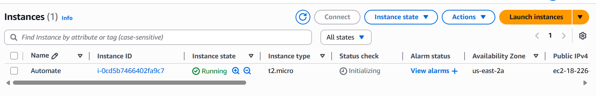
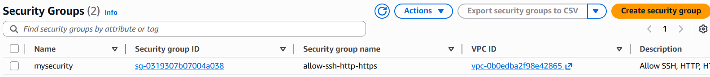
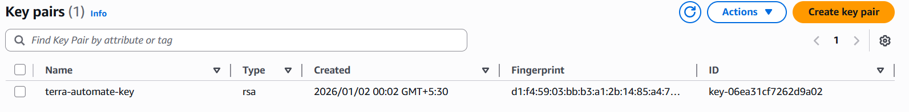

# 🌍 TerraPilot

> Python-driven Terraform automation — manage your entire infrastructure lifecycle from a single script.

<div align="center">


</div>

---

## 🎬 See It In Action

<div align="center">
  
</div>

---

## 🚀 What is TerraPilot?

Stop typing `terraform init`, `terraform plan`, `terraform apply` manually.

TerraPilot wraps your entire Terraform workflow in a single Python script — automating initialization, planning, applying, and destroying infrastructure with zero manual CLI intervention. Built for DevOps engineers who value speed, consistency, and repeatability.

---

## ⚙️ How It Works
```
┌──────────────┐      ┌─────────────────┐      ┌──────────────────┐
│  terra.py    │─────▶│  subprocess     │─────▶│  Terraform CLI   │
│  (Python)    │      │  (automation)   │      │  init/apply/destroy│
└──────────────┘      └─────────────────┘      └──────────────────┘
                                                        │
                                                        ▼
                                               ┌──────────────────┐
                                               │   AWS Resources  │
                                               │  EC2 · SG · Keys │
                                               └──────────────────┘
```

---

## ✨ Features

| Feature | Description |
|---|---|
| 🤖 **Full Automation** | Runs `init`, `plan`, `apply`, `destroy` via Python |
| ⚡ **Zero Manual CLI** | No terminal commands needed after setup |
| 🔁 **Consistent Execution** | Same result every run — no human error |
| ☁️ **AWS Ready** | Provisions EC2, Security Groups, Key Pairs |
| 🧹 **Clean Teardown** | Automated destroy prevents cost overruns |

---

## ⚡ Quick Start
```bash
# 1. Clone
git clone https://github.com/Erharshita-cloud/TerraPilot.git
cd TerraPilot

# 2. Verify Terraform
terraform -version

# 3. Configure AWS credentials
aws configure

# 4. Launch
python terra.py
```

---

## 📸 Output

| EC2 Instance | Security Group | Key Pair |
|---|---|---|
|  |  |  |

---

## 📂 Project Structure
```
TerraPilot/
├── terraform/        # HCL configuration files
├── terra.py          # Python automation engine
├── images/           # Output screenshots
└── README.md
```

---

## 🤝 Contributing
PRs and suggestions welcome!

**Harshita Goel** · DevOps & Cloud Engineer
[GitHub](https://github.com/Erharshita-cloud) · harshitagoel1503@gmail.com

---

<div align="center">⭐ Star this repo if it helped you!</div>
